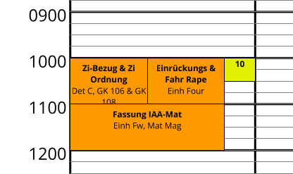
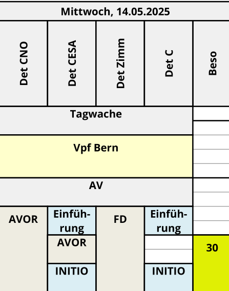
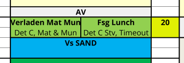

# WAP Tool

Automate the generation of WAPs (Wochenarbeitsplan).

## Quickstart

Goal: edit a WAP as yaml and print it.

Requires docker and tar installed.

1. Download the wap tool archive `wap-tool.tar.gz` from the sharepoint `KVP Stufe KP > WAP tool > Dist`. Decompress:

 ``` sh
tar xzf wap-tool.tar.gz
```

2. Load the docker image

``` sh
docker image load -i docker-wap-tool.tar
# verify it is loaded
docker run wap-tool:latest --help
```

3. We create a minimal example data (`data/minimal.yaml`):

``` yaml
meta: # define metadata
  author: Autor
  firstDay: 2025-04-20
  startTime: '05:30'
  endTime: '23:00'
  unit: 'Kp 42/3'
  title: Det X
  version: 'Stand: 19.04.2025'
categories:
- identifier: Orange
  color: '#ff9900'
weeks:
- remarks:
  - Hier ist eine Wochenbemerkung.
  days:
  - remarks:
      - Das ist eine Tagesbemerkung
      - Hier ist eine weitere
    columns: # split the day in these columns
    - Det
    - Beso
    events:
    - title: Zi-Bezug & Zi Ordnung
      start: '10:00' # must give a start time
      end: '11:00' # as well as an end time
      appearsIn: # in which columns, defined above, the event appears
      - Det
      category: Orange # references cateogiry defined above
      description: Det C, GK 106 & GK 108
    - title: Einrückungs & Fahr Rape
      start: '10:00'
      end: '11:00'
      appearsIn:
      - Det
      category: Orange
      description: Einh Four  # optionally a description can be given
    - title: Kontrolle AWB Karte
      start: '10:00'
      end: '10:30'
      footnote: true # Footnotes are printed below the day
      appearsIn:
      - Beso
      description: Fkhaus 15, Det C
    - title: Fassung IAA-Mat
      start: '11:00'
      end: '12:00'
      appearsIn:
      - Det
      category: Orange
      description: Einh Fw, Mat Mag
```

4. Run with docker to get a pdf (`examples/minimal.pdf`)

``` sh
./run-docker.sh data/minimal.yaml minimal.pdf
xdg-open minimal.pdf
```

We should see the events we defined


Now to create a realistic wap you may have a template to get started or you can use the folder `data/` for inspiration.
Note the warnings printed if your data is malformed.

### Improved DX

Use the following command to automatically update the genereated WAP PDF, when the configuration file has changed:

```bash
echo ../data/det7.yaml | entr ./wap-tool ../data/det7.yaml > ../examples/det7.pdf
```

## Docs

The [schema](schema/wap.json) remains the source of truth for the model.
We describe the most important fields.

- `meta` about the WAP.
- `categories` used for styling. Currently only background color is supported.
- `weeks`
  - `remarks`: printed in right column
  - `days`
    - `remarks`: printed below the day
    - `columns`: split the day in columns
    - `events`

Events can be made repeating (`repeating: daily`), e.g., for ABV or regular FD. The event will be displayed for every following day.
Note that the columns may be different for other days.
So you might want to add extra columns to `appearsIn` of the repeating event.
Regular events take precedence and are printed over repeating events if they are defined later.

Events extend over adjacent columns, or are split otherwise. In the example below

- Tagwache is merged over the four dets
- Einführung and INITIO has `appersIn: [Det CESA, Det C]` so it is split



Footnotes are events with `footnote: true`.
They are displayed by their number and described below the day.

Events can overlap in time.
Then, a column is split further into subcolumns.
This is supported only for events that appear in a single column.
Example:


What is not (yet) supported:

- No text markup. Event titles are bold, otherwise all text is printed plain.
  For the remarks column this could be desirable.

### Tool Support

The [vscode-yaml](https://github.com/redhat-developer/vscode-yaml) extension is recommended.
Autocompletion is available and validations are available.
For example, dates are checked to be in the right format.

Associate the correct schema with your file by either including the following line in your yaml file (you might have to modify the path):

``` yaml
# yaml-language-server: $schema=../schema/wap.json
```

Or, by associating the schema definition with a glob pattern in your `settings.json`:

``` yaml
{
    "yaml.schemas": {
       "./schema/wap.json": "*"
    },
}
```

## Project

### Background

Most WKs share a similar format.
By editing a template, a new WAP should be easily defined.

Currently, WAPs are mostly edited in Excel.
Layouting and formating is done manually, events are simply shapes overlayed over the cells.
However, Excel provides great flexibility and is widely known.

Miloffice provides similar capabilities, but it is slow and has a bad user experience.

WAPs have a typical format: each page show a week. Days are columns, that can be further subdivided in subcolumns.
Events are drawn in the week, have a description and are styled in a certain way.
Additionaly, remarks can be added for the day or the entire week.

While we tried to reproduce this original format, **the WAP format is not regulated and could be changed**.

While we target the use in our company first, it could be reused in other places as this is a general problem in the military.
<!-- specialities: not a typical calendar -->

### Implementation

- Intermediate Data Format: define the WAP data
  - model defined as a [JSON schema](https://json-schema.org/)
  - edited as YAML
  - A human and machine friendly format, that is widely known and comes with good tool support
  - We tried to make it easy to adapt an existing WAP. For example, to change the date we must only change the initial date. All other days are offset from this date.
- Backend: print the WAP
  - at the moment, a Go tool can generate pdfs

### Future Work

1. Create a frontend to simplify editing
    - editing the yaml by hand can be tedious as well: For example, resizing an event is easier than edit timestamps or dragging events instead of copy-and-pasting lines.
    - there are many pitfalls, and it could be challenging to support all features
    - import/export as yaml
    - could reuse/reimlement the existing layout algo

2. Alternatively, provide tool to simplify editing the yaml.
    - Shift all start/end times for a day after a given time
    - Harmonize the data: sort the events per day, use the same order of fields, ...
    - Delete a column (for a day)

3. Generate *Tagesbefehle*. Use the same or similar format to generate detailed plans for a single day.

## Development

For the Go backend, see [go/DEV.md](./go/DEV.md)
