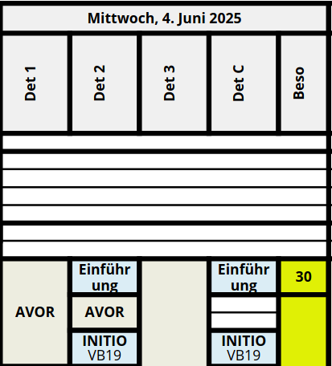

# WAP Tool

Automate the generation of WAPs (Wochenarbeitsplan).

## Quickstart

Goal: edit a WAP as yaml and print it.

1. We create a minimal example data (`data/minimal.yml`):

``` yaml
meta:
  title: Det X
  unit: Kp 12/3
  author: Autor
  version: 'Stand: 19.06.2025'
  signerText: |-
    Wm Hülsensack
    Kp 12/3
  startTime: '05:30'
  endTime: '23:30'
  firstDay: '2025-06-16'
categories:
  - identifier: Orange
    color: '#F5A623'
    textColor: '#9013FE'
weeks:
  - days:
      - title: Montag, 16.6.2025
        columns:
          - Det
          - Det C
        remarks:
          - title: Hier ist eine Wochenbemerkung
          - title: Hier ist ein Beso
            start: '14:00'
            end: '15:00'
        events:
          - title: Zi-Bezug & Zi Ordnung
            start: '10:00'
            end: '11:00'
            category: Orange
            appearsIn:
              - Det
          - title: Einrükcung und Fahr Repe
            start: '09:00'
            end: '10:00'
            appearsIn:
              - Det
              - Det C
          - title: Fassung IAA Mat
            description: ' Ein Four'
            start: '11:00'
            end: '12:00'
            appearsIn:
              - Det
              - Det C
          - title: Abrücken
            start: '14:00'
            end: '16:00'
            openEnd: true
          - title: Lunch Fassen
            description: Kantine
            start: '11:45'
            end: '12:30'
            appearsIn:
              - Det C
            zIndex: 1
      - title: Dienstag, 17.6.2025
        columns:
          - Det
        events:
          - title: Ein langes Event
            description: Mit einer langen Beschreibung, die auf zwei Zeilen gehen muss
            start: '08:00'
            end: '12:00'
          - title: Noch ein langes Event
            start: '12:00'
            end: '23:00'
      - title: Mittwoch, 18.6.2025
      - title: Donnerstag, 19.6.2025
      - title: Freitag, 20.6.2025
      - title: Samstag, 21.6.2025
      - title: Sonntag, 22.6.2025
    title: Woche vom Montag, 16.6.2025
    remarks:
      - Eine Wochenbemerkung
```

2. Upload to the frontend (wernerson.github.io/wap-tool)
3. Edit in the frontend to your liking
4. Export as either PDF or YAML

You should now see the events you defined.

Now to create a realistic wap you may have a template to get started or you can use the folder `data/` for inspiration.

## Developing
To develop this application, you must have npm and node installed. Simply run `npm i` inside the `ui` folder to install all the packages. Then you can run `npm run dev` to locally start the application. It automatically refreshes, when code is changed.

## Docs

The [schema](schema/wap.json) remains the source of truth for the model.
We describe the most important fields.

- `meta` about the WAP.
- `categories` used for styling. Currently background color and text color is supported: 

- `weeks`
  - `remarks`: printed in right column
  - `days`
    - `remarks`: printed below the day
    - `columns`: split the day in columns
    - `events`

Events extend over adjacent columns, or are split otherwise. In the example below

- AV is merged over the four dets
- Einführung and INITIO has `appersIn: [Det 2, Det C]` so it is split



Footnotes are defined in the `remarks`. If they have a time, they appear in the Beso column, where they are displayed with their number and described below the day. 
If a remark has no times defined, it is displayed plainly below the day.

Events can overlap in time.
In that case we can define a Z-Index, to determine which event should be drawn over another
Example:


An event can be marked `openEnd` to appear with a wavy bottom.
Example:


When an event reaches an aspect ratio (height/width) of more than 2, the text is displayed vertically. The text can be forced to appear horizontal with the `forceHorizontalText` property.

What is not (yet) supported:

- No text markup. Event titles are bold, otherwise all text is printed plain.
  For the remarks column this could be desirable.

## Project

### Background

Most WKs share a similar format.
By editing a template, a new WAP should be easily defined.

Currently, WAPs are mostly edited in Excel.
Layouting and formating is done manually, events are simply shapes overlayed over the cells.
However, Excel provides great flexibility and is widely known.

Miloffice provides similar capabilities, but it is slow and has a bad user experience.

WAPs have a typical format: each page show a week. Days are columns, that can be further subdivided in subcolumns.
Events are drawn in the week, have a description and are styled in a certain way.
Additionaly, remarks can be added for the day or the entire week.

While we tried to reproduce this original format, **the WAP format is not regulated and could be changed**.

While we target the use in our company first, it could be reused in other places as this is a general problem in the military.

### Implementation

- Frontend
  - The frontend is built using [jsonForms](https://jsonforms.io/docs/) and Vuetify. This allows for quick changes and additions of new properties to the schema.
  - The frontend is localized into German, French, Italian and English. All translations are found in [i18n.json](ui/src/i18n.json)
- Printing the WAP
  - The WAP is printed using [jsPdf](https://github.com/parallax/jsPDF)
- The whole project is designed, such that no backend is needed. This way, it can be easily hosted on github pages

### Future Work

- Validation messages are not printed very nicely in the frontend. They are the default messages form jsonForms, which can be cryptic at times. This could be improved upon.
- There are still some features missing with the WAP tool. For example, events that take place in parallel such as this one: 

- One could add a live preview of the rendered PDF, such that one does not have to download the WAP to check it out on every change.